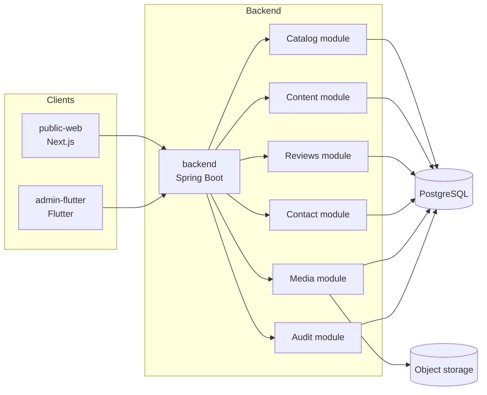

# Container view

```mermaid
flowchart LR
  subgraph Clients
    WEB[public-web
Next.js]
    ADM[admin-flutter
Flutter]
  end

  subgraph Backend
    API[backend
Spring Boot]
    CATALOG[Catalog module]
    CONTENT[Content module]
    REVIEWS[Reviews module]
    CONTACT[Contact module]
    MEDIA[Media module]
    AUDIT[Audit module]
  end

  DB[(PostgreSQL)]
  OBJ[(Object storage)]

  WEB --> API
  ADM --> API
  API --> CATALOG
  API --> CONTENT
  API --> REVIEWS
  API --> CONTACT
  API --> MEDIA
  API --> AUDIT
  CATALOG --> DB
  CONTENT --> DB
  REVIEWS --> DB
  CONTACT --> DB
  MEDIA --> DB
  MEDIA --> OBJ
  AUDIT --> DB
```
