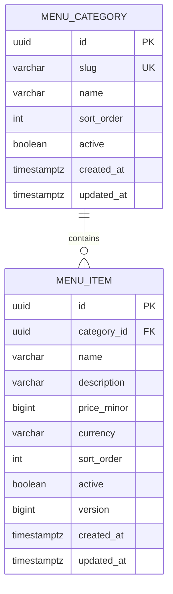

# Initial data model

```mermaid
erDiagram
  MENU_CATEGORY ||--o{ MENU_ITEM : contains

  MENU_CATEGORY {
    uuid id PK
    varchar slug UK
    varchar name
    int sort_order
    boolean active
    timestamptz created_at
    timestamptz updated_at
  }

  MENU_ITEM {
    uuid id PK
    uuid category_id FK
    varchar name
    varchar description
    bigint price_minor
    varchar currency
    int sort_order
    boolean active
    bigint version
    timestamptz created_at
    timestamptz updated_at
  }
```

Money is stored in minor units plus ISO currency code rather than floating point.
