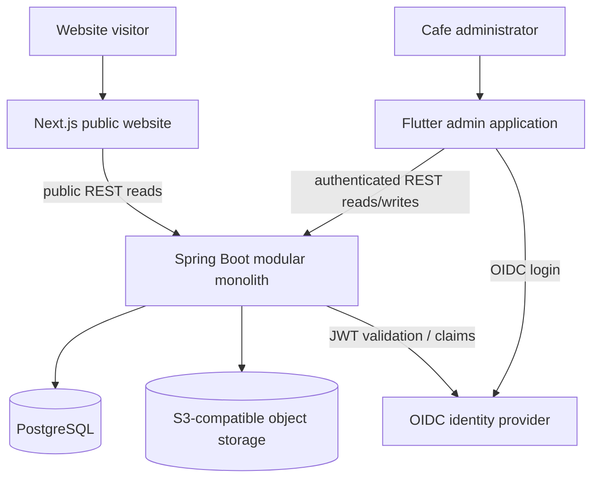

# System context

```mermaid
flowchart TB
  Visitor[Website visitor]
  Admin[Cafe administrator]
  Web[Next.js public website]
  AdminApp[Flutter admin application]
  API[Spring Boot modular monolith]
  DB[(PostgreSQL)]
  Object[(S3-compatible object storage)]
  IdP[OIDC identity provider]

  Visitor --> Web
  Admin --> AdminApp
  Web -->|public REST reads| API
  AdminApp -->|authenticated REST reads/writes| API
  API --> DB
  API --> Object
  AdminApp -->|OIDC login| IdP
  API -->|JWT validation / claims| IdP
```

The initial slice implements Web -> API -> PostgreSQL for catalog reads. Dashed/future concerns are recorded as proposed ADRs before code is added.
